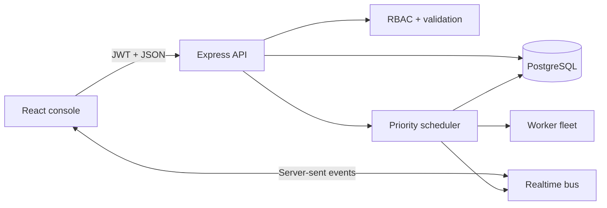
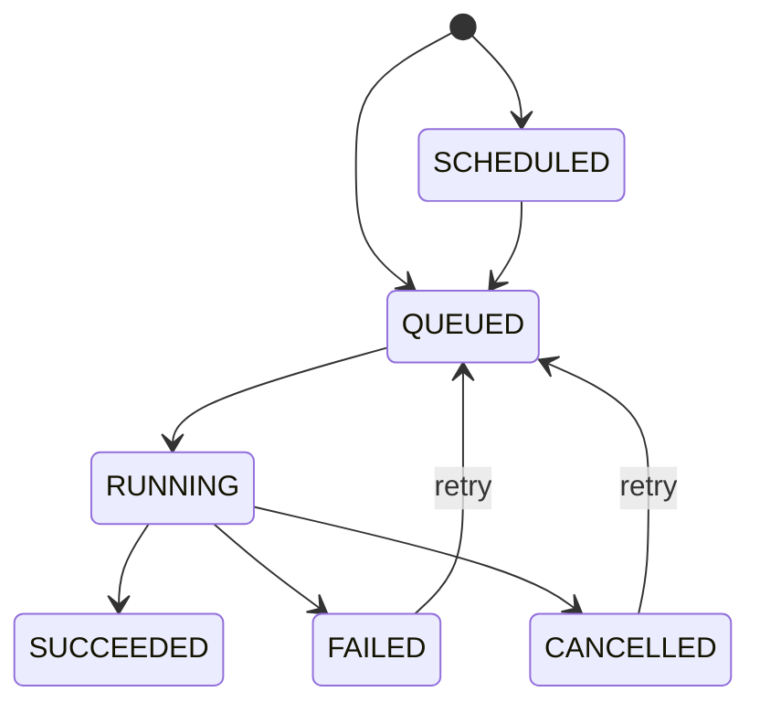

# ML Job Control Center

[](https://github.com/dragon122177/ml-job-control-center/actions/workflows/ci.yml)
[](https://nodejs.org/)
[](https://www.typescriptlang.org/)
[](LICENSE)

ML Job Control Center is a production-shaped operations platform for scheduling,
observing, and governing machine-learning workloads. It combines a secure control
API, a priority scheduler, a multi-worker fleet simulator, realtime telemetry, and
a responsive operations console.

The project is designed as a portfolio-grade reference implementation: it runs
locally with zero infrastructure, but the same application can connect to
PostgreSQL through Docker Compose.

> All users, workers, metrics, storage addresses, datasets, and models in the demo
> are fictional. The built-in workers simulate ML execution; this application does
> not run untrusted training code.

## What it demonstrates

- Job scheduling with priorities, future release times, cancellation, and retries
- Explicit lifecycle state machine with conflict-safe transitions
- Resource-aware assignment across CPU and GPU worker pools
- Live progress, training metrics, event history, and server-sent events
- Projects, datasets, experiments, and a versioned model registry
- Operational alerts, acknowledgement flow, and system diagnostics
- JWT authentication and API-enforced role-based access control
- Append-only audit history for sensitive commands
- PostgreSQL-compatible relational model with indexes and foreign keys
- Strict TypeScript, integration tests, component tests, Docker, and CI

## Product tour

| Area | Capabilities |
|---|---|
| Overview | Fleet capacity, success rate, active alerts, recent workloads |
| Jobs | Filter, search, schedule, launch, cancel, retry, inspect telemetry |
| Experiments | Owners, run counts, status, and best metric comparison |
| Model registry | Version, framework, stage, accuracy, and artifact lineage |
| Datasets | Versioned assets, row counts, size, storage, validation status |
| Infrastructure | Worker pools, slots, accelerators, health, and alerts |
| Audit trail | Actor, command, target, metadata, and timestamp history |

## Architecture



The repository is an npm-workspaces monorepo:

```text
apps/
├── api/  Express control API, scheduler, database, integration tests
└── web/  React operations console and component tests
docs/
├── API.md
├── ARCHITECTURE.md
└── openapi.yaml
```

See [Architecture](docs/ARCHITECTURE.md) for boundaries, lifecycle diagrams,
security decisions, and the production evolution path.

## Technology

**Frontend:** React 19, TypeScript, Vite, Lucide, responsive CSS  
**Backend:** Node.js, Express 5, Zod, JWT, bcrypt, Helmet, Pino  
**Data:** PostgreSQL / pg-mem, parameterized SQL, relational constraints  
**Realtime:** authenticated server-sent events  
**Quality:** Vitest, Testing Library, Supertest, GitHub Actions  
**Operations:** Docker Compose, Nginx, health checks

## Quick start

Requirements: Node.js 20+ and npm 10+.

```bash
npm install
npm run dev
```

Open [http://localhost:5173](http://localhost:5173). The API listens on
`http://localhost:4100`.

The default mode creates an embedded PostgreSQL-compatible database, seeds a
fictional operations environment, and starts the scheduler. The database resets
when the API restarts, making the demonstration repeatable.

### Demo accounts

Every account uses the password `demo1234`.

| Role | Email | Access |
|---|---|---|
| Administrator | `admin@mlcontrol.demo` | All operations and audit history |
| Operator | `operator@mlcontrol.demo` | Workload operations and alerts |
| Viewer | `viewer@mlcontrol.demo` | Read-only dashboards and catalogs |

## Docker with PostgreSQL

```bash
docker compose up --build
```

Open [http://localhost:8080](http://localhost:8080). Docker Compose starts
PostgreSQL 16, the API, Nginx, health checks, and the web console.

To reset Docker data:

```bash
docker compose down -v
```

## Job lifecycle



`CRITICAL` jobs are selected before `HIGH`, `NORMAL`, and `LOW` jobs. The
scheduler then chooses a compatible online worker with available slots. Execution
emits progress metrics and events; failures follow the configured retry policy.

## Commands

```bash
npm run dev        # Start API and web development servers
npm run typecheck  # Validate strict TypeScript in both workspaces
npm test           # Run API, state-machine, and UI tests
npm run build      # Produce both production bundles
npm start          # Start the compiled API
```

## API overview

All routes except health and login require `Authorization: Bearer <token>`.

| Method | Endpoint | Purpose |
|---|---|---|
| POST | `/api/auth/login` | Authenticate and issue an eight-hour token |
| GET | `/api/dashboard` | Operational summary |
| GET / POST | `/api/jobs` | List, filter, or create workloads |
| GET | `/api/jobs/:id` | Configuration, metrics, and events |
| POST | `/api/jobs/:id/cancel` | Cancel active or waiting work |
| POST | `/api/jobs/:id/retry` | Requeue within retry policy |
| GET | `/api/catalog/*` | Projects, datasets, experiments, models |
| GET | `/api/operations/workers` | Worker fleet and capacity |
| GET | `/api/operations/alerts` | Alert center |
| GET | `/api/operations/audit` | Administrator audit history |
| GET | `/api/events` | Realtime authenticated event stream |

See the [API guide](docs/API.md) and [OpenAPI contract](docs/openapi.yaml).

## Security model

- Bcrypt password hashes
- Eight-hour signed JWT access tokens
- `ADMIN`, `OPERATOR`, and `VIEWER` route enforcement
- Zod input validation and size-limited JSON
- Parameterized SQL
- Helmet security headers
- Login and global request rate limits
- Authorization-header log redaction
- Audit records for authentication and sensitive mutations

The published credentials and default development secret are only for the
fictional local demo. See [SECURITY.md](SECURITY.md) before deployment.

## Verification

The automated suite covers:

- valid and invalid lifecycle transitions;
- retry-limit enforcement;
- authentication and authorization;
- dashboard and catalog access;
- workload creation, assignment, cancellation, and retry;
- worker capacity and runtime diagnostics;
- administrative audit restrictions;
- status, progress, and telemetry UI components.

GitHub Actions runs type checking, all tests, and both production builds on every
push and pull request.

## Engineering decisions

1. **Runnable beats hypothetical.** The embedded mode lets a reviewer explore the
   entire product without cloud credentials, GPUs, or Docker.
2. **The state machine owns lifecycle rules.** API buttons cannot bypass allowed
   transitions or retry limits.
3. **Authorization lives in the API.** Hiding a UI control never grants security.
4. **Operations are observable.** Each job exposes structured events and metrics,
   while sensitive commands create audit records.
5. **The worker boundary is explicit.** The portfolio uses deterministic simulated
   execution; a durable queue or Kubernetes adapter can replace it without changing
   the product model.

## Production roadmap

- Durable queue and Kubernetes Job adapter
- Distributed scheduler leadership and idempotency keys
- Versioned PostgreSQL migrations
- OIDC, MFA, and refresh-token rotation
- Signed model artifacts and dataset lineage checks
- OpenTelemetry traces, metrics, and alert integrations
- Pagination and saved views for large installations
- End-to-end browser testing

## Documentation

- [Architecture](docs/ARCHITECTURE.md)
- [API guide](docs/API.md)
- [Spanish project explanation](PROJECT_EXPLANATION_ES.md)
- [English interview guide](INTERVIEW_GUIDE_EN.md)
- [GitHub upload guide in Spanish](UPLOAD_TO_GITHUB_ES.md)
- [Contributing](CONTRIBUTING.md)
- [Security](SECURITY.md)

## License

MIT. See [LICENSE](LICENSE).
