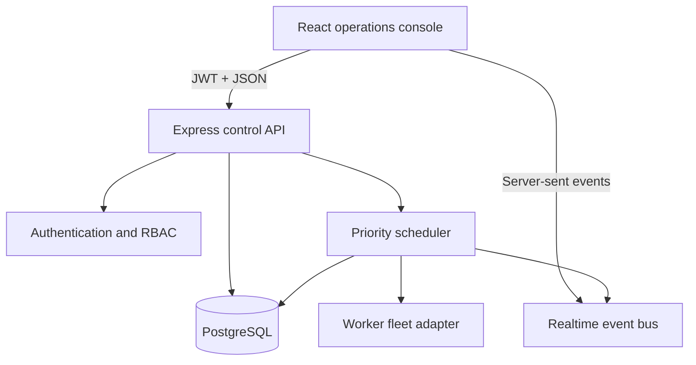
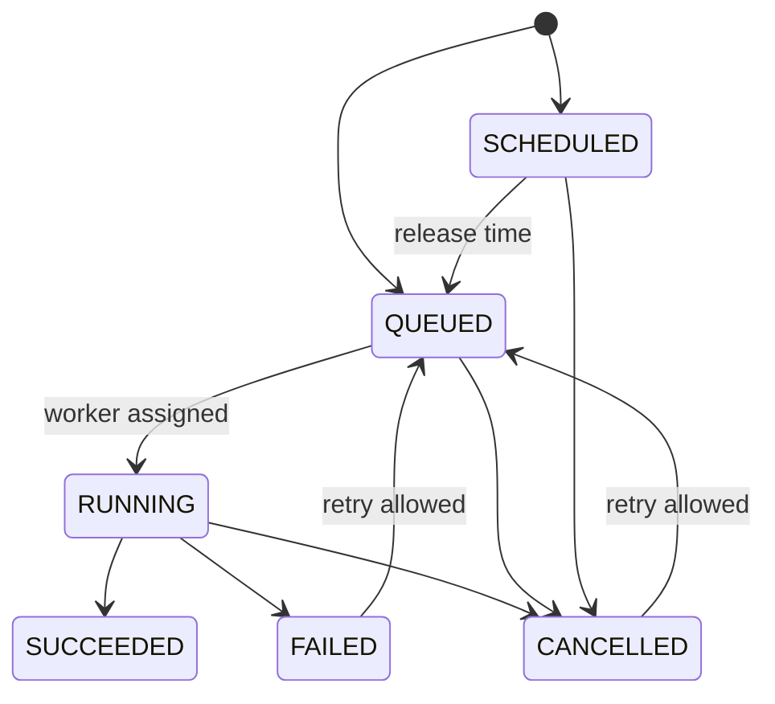
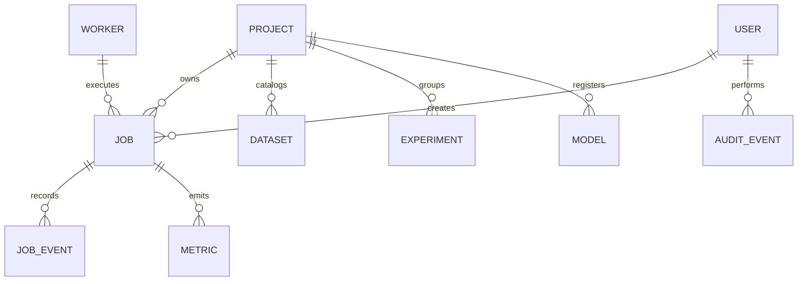

# Architecture

## Purpose

ML Job Control Center is a reference control plane for machine-learning workload
operations. It coordinates metadata and lifecycle state; it does not pretend to be
a full training framework or execute untrusted user code.

## Runtime topology

The zero-configuration mode uses `pg-mem`, a PostgreSQL-compatible in-process
database. Docker Compose switches the same query layer to PostgreSQL 16.

## Control-plane boundaries

The project separates four responsibilities:

1. **Command API** validates requests, enforces roles, and records audit events.
2. **State machine** guards allowed job lifecycle transitions.
3. **Scheduler** releases scheduled jobs, ranks queue priority, selects capacity,
   advances the demonstration workers, records metrics, and applies retry policy.
4. **Realtime bus** publishes non-sensitive state changes to authenticated browser
   sessions through server-sent events.

## Job lifecycle

Priority ranking is `CRITICAL`, `HIGH`, `NORMAL`, then `LOW`. Within the same
priority, older jobs are selected first.

## Data model

## Security decisions

- Password hashes use bcrypt.
- Access tokens expire after eight hours.
- Route-level RBAC defines `ADMIN`, `OPERATOR`, and `VIEWER` capabilities.
- Zod validates command payloads.
- SQL queries are parameterized.
- Helmet sets defensive HTTP headers.
- Login and general API rate limits reduce abuse.
- Sensitive commands generate append-only audit events.
- Logger redaction removes bearer tokens.

## Production evolution

The built-in scheduler is deliberately single-process so the portfolio project can
run on any laptop. A production deployment would preserve the state machine and API
while replacing the demonstration worker adapter with a durable queue or Kubernetes
job adapter. It would also introduce distributed locking, idempotency keys,
versioned database migrations, OpenTelemetry, secrets management, and artifact
signing.
